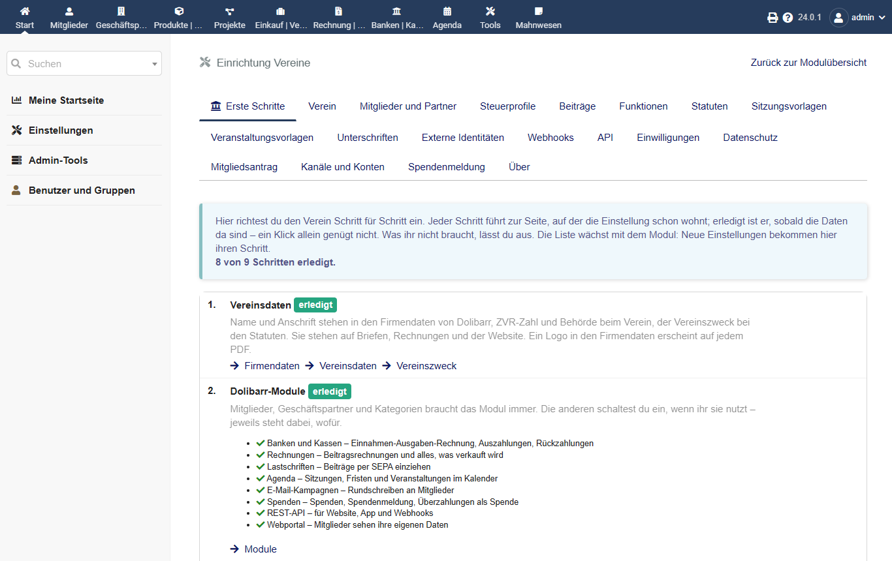
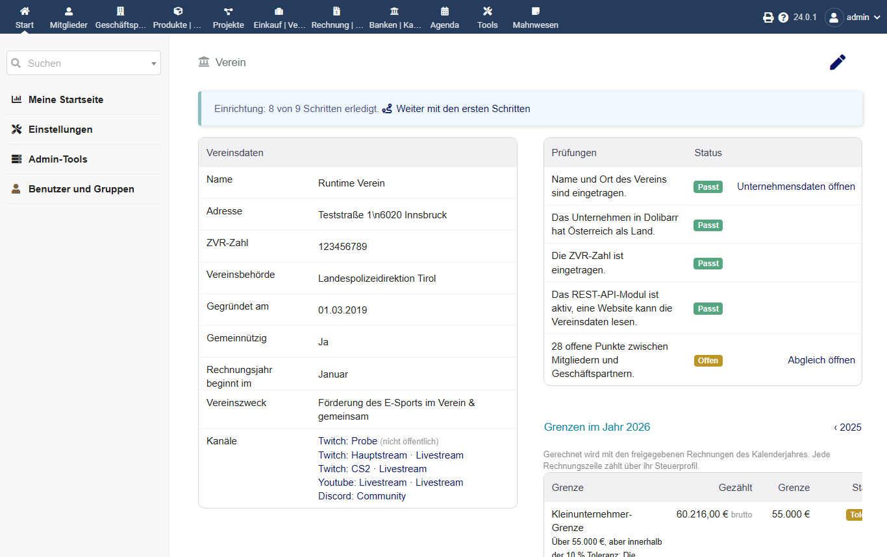
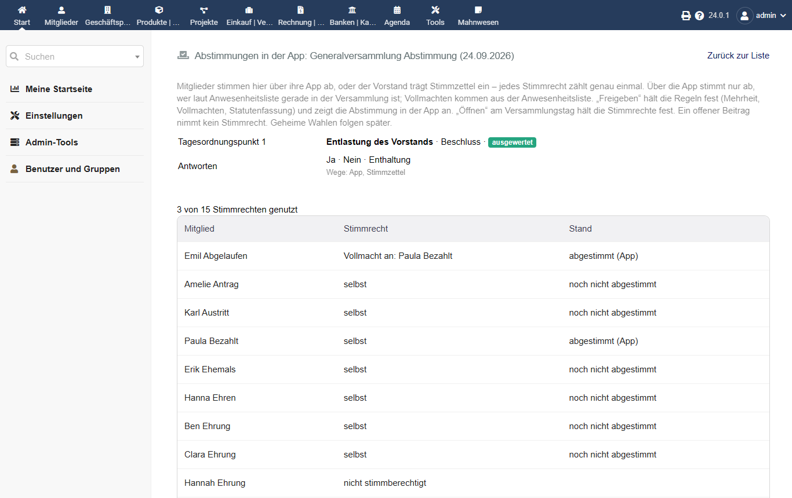
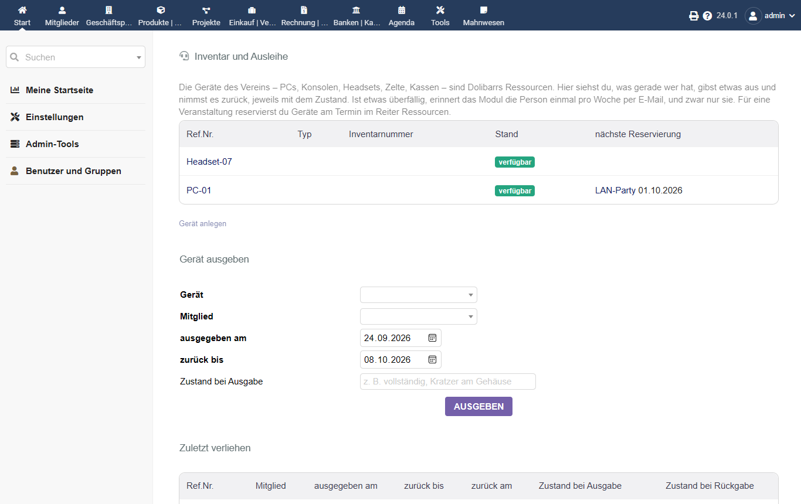
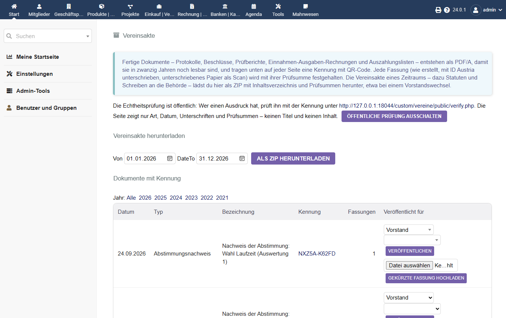
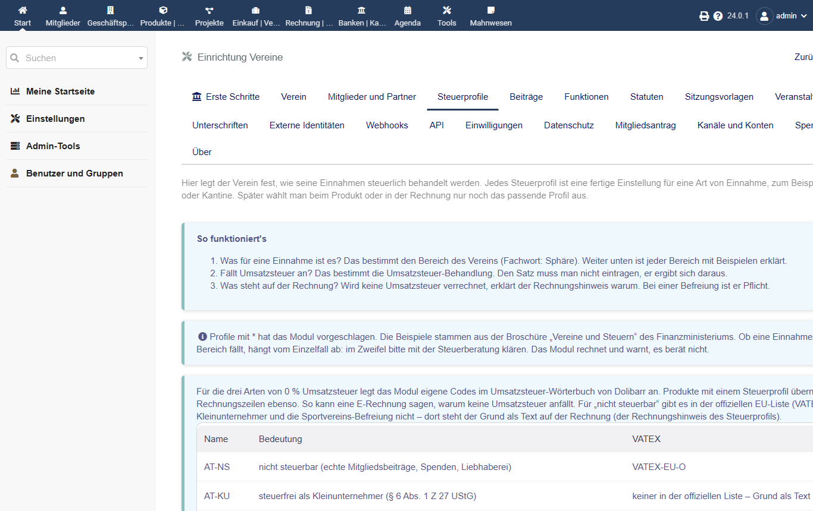
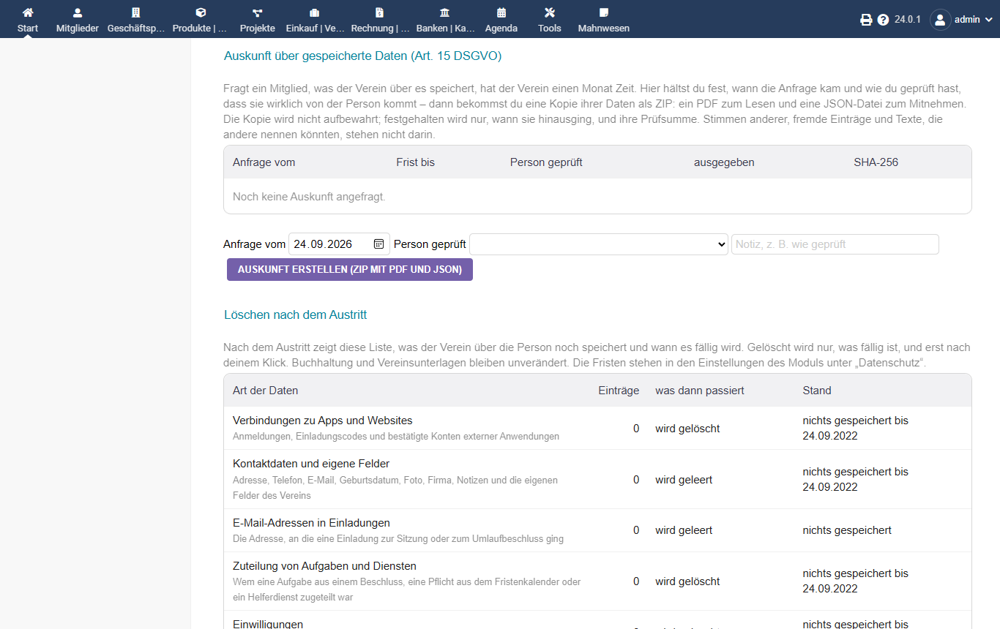
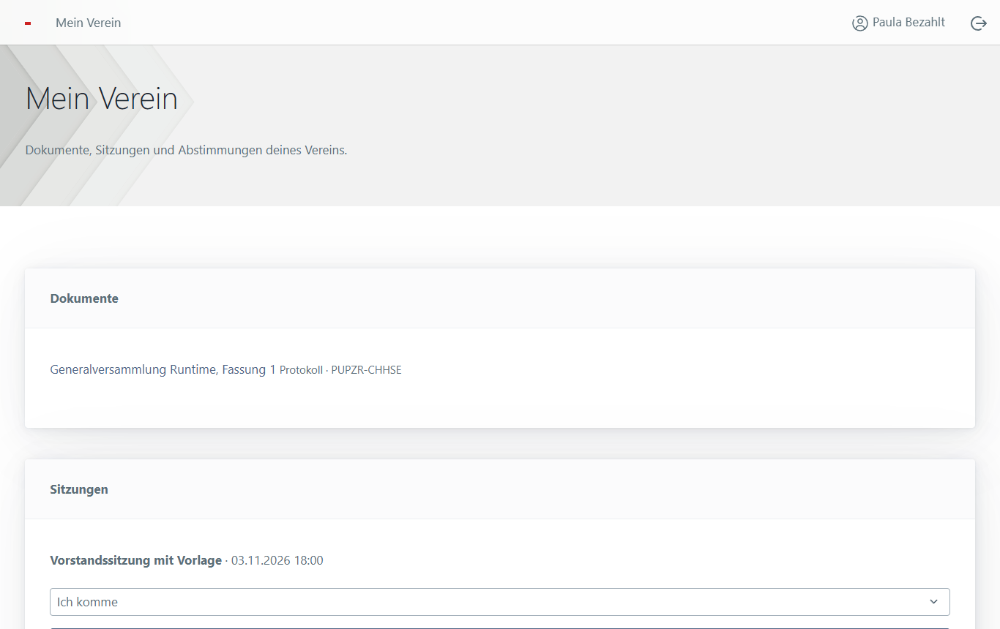

# Handbuch: Vereine für Dolibarr

Für alle, die im Verein mit Dolibarr arbeiten: Obfrau oder Obmann, Kassa, Schriftführung und wer
Dolibarr für den Verein betreut. Installation, Updates und die Anbindung einer Website stehen im
[README](../README.md). Dieses Handbuch erklärt, wer was darf, wie das Vereinsjahr im Modul abläuft
und was der Verein für den Datenschutz braucht.

Das Modul rechnet, erinnert und hält fest. Entscheiden müsst ihr selbst. Wo Gesetze vorkommen, steht
die Quelle in [LEGAL-SOURCES.md](LEGAL-SOURCES.md). Das ist keine Rechts- oder Steuerberatung.

Die Bilder zeigen einen Testverein mit erfundenen Namen. Sie liegen nur auf GitHub, nicht im ZIP des Moduls.

## Einrichten

Nach dem Einschalten führt *Start > Einstellungen > Module > Vereine > Erste Schritte* durch alles,
was ein Verein einstellen sollte. Die Seite erkennt an den Daten, was schon erledigt ist.

Die übrigen Reiter der Einrichtung:

| Reiter | Was dort eingestellt wird |
| --- | --- |
| Verein | ZVR-Zahl, Vereinsbehörde, Vereinszweck |
| Mitglieder und Partner | ob zu jedem Mitglied ein Geschäftspartner entsteht, Kategorien |
| Steuerprofile | wie Einnahmen und Ausgaben steuerlich eingeordnet werden; die Codes für 0 % mit Begründung für E-Rechnungen |
| Beiträge | Beitragsmodell je Mitgliedsart, Familien, Ermäßigungen, SEPA, Kündigungsfrist für Austritte |
| Funktionen | Vorstand und andere Funktionen mit ihrer Funktionsperiode |
| Statuten | Einladungsfristen, Beschlussfähigkeit, Mehrheiten, Stimmrechtsvertretung, Statutentext |
| Sitzungsvorlagen, Veranstaltungsvorlagen | Tagesordnungen und Aufgaben zum Wiederverwenden |
| Unterschriften | wer welches Dokument unterschreibt; ID Austria, siehe [ID-AUSTRIA.md](ID-AUSTRIA.md) |
| Einwilligungen | Zwecke und Texte, zum Beispiel für Fotos |
| Mitgliedsantrag | welche Felder der Antrag hat, auch eigene Felder |
| Kanäle und Konten | Discord, Twitch, YouTube & Co. des Vereins für die Website; welche Konten der Antrag und die App abfragen |
| Spendenmeldung | Art der Einrichtung, Finanzamtsnummern, Zugang zum Stammzahlenregister |
| Externe Identitäten, API, Webhooks | Website und Apps, siehe [Externe Anwendungen](#externe-anwendungen) |
| Datenschutz | was über ehemalige Mitglieder wie lange bleibt, siehe [Löschen nach dem Austritt](#löschen-nach-dem-austritt) |

## Wer darf was

Dolibarr vergibt Rechte je Benutzer oder, einfacher, je Gruppe (*Start > Benutzer & Gruppen >
Gruppen*). Das Modul nutzt Dolibarrs eigene Rechte für Mitglieder, Rechnungen und Bank und bringt
eigene mit. Alle Seiten des Modules brauchen **Vereinsübersicht und Vereinsdaten lesen**.

| Aufgabe | Nötige Rechte |
| --- | --- |
| Überblick, Fristen, Veranstaltungen, Vereinsakte ansehen | *Vereine*: Vereinsübersicht und Vereinsdaten lesen |
| Sitzungen, Beschlüsse, Funktionen, Anträge, Reiter *Verein* der Mitgliedskarte ansehen | dazu *Mitglieder*: lesen |
| Sitzungen anlegen und einladen, Austritte, Einwilligungen, Auskunft erstellen | dazu *Mitglieder*: anlegen/ändern |
| Daten ehemaliger Mitglieder löschen | dazu *Mitglieder*: löschen |
| Mitglieder und Geschäftspartner abgleichen | *Vereine*: verknüpfen und abgleichen, dazu *Mitglieder*: anlegen/ändern und *Geschäftspartner*: lesen und anlegen |
| Einnahmen-Ausgaben-Rechnung | dazu *Banken*: lesen |
| Rechnungsprüfung, Überzahlungen | dazu *Rechnungen*: lesen |
| Spendenmeldung (sieht Geburtsdaten und vbPK) | *Vereine*: Spendenmeldung vorbereiten |
| Einrichtung des Moduls | Administrator |

Ein Vorschlag für Gruppen, anzupassen an eure Statuten:

- **Vorstand**: lesen, Mitglieder lesen und ändern, Rechnungen lesen.
- **Kassa**: wie Vorstand, dazu Banken lesen und, wenn der Verein spendenbegünstigt ist,
  Spendenmeldung vorbereiten.
- **Schriftführung**: wie Vorstand. Mitglieder löschen bekommt nur, wer sich um den Datenschutz kümmert.
- **Rechnungsprüfung**: nur lesen, dazu Rechnungen und Banken lesen. Nichts ändern.
- **Website oder App**: ein eigener technischer Benutzer, nie ein Mensch, siehe
  [Externe Anwendungen](#externe-anwendungen).

Wenig Rechte sind besser als viele: Wer nur lesen muss, bekommt nur Lesen.

## Das Vereinsjahr

Alles liegt unter *Mitglieder > Verein*. Die Übersicht zeigt oben *Zu erledigen*: fällige
Meldungen, Wahlen, Anträge, Unterschriften und Rückstände, das Dringendste zuerst.

- **Beiträge**: *Beitragslauf* erstellt die Rechnungen des Zeitraums nach dem Beitragsmodell der
  Mitgliedsart. Zahlungen bucht ihr in Dolibarr wie immer. Eine Überzahlung meldet die Rechnung
  selbst, unter *Überzahlungen* ordnet ihr den Mehrbetrag zu.
- **Mahnungen**: macht das Modul *Mahnwesen*, wenn ihr es nutzt. Erreicht ein Beitrag dort die
  letzte Stufe „Mitgliedschaft prüfen“, erscheint er beim Anlegen der nächsten Vorstandssitzung als
  Vorschlag für die Tagesordnung. Ausgeschlossen wird niemand automatisch.
- **Sitzungen**: aus einer Vorlage anlegen, einladen, Anwesenheit und Abstimmungen erfassen, das
  Protokoll schreiben und unterschreiben lassen. Beschlüsse landen im *Beschlussbuch*, Aufgaben
  daraus bei der zuständigen Person. Zwischen Sitzungen gibt es *Umlaufbeschlüsse*.
- **Abstimmungen in der App**: In einer Generalversammlung können Mitglieder über ihre App oder das
  Webportal abstimmen, der Vorstand trägt Stimmzettel ein. Unter *Sitzung > Abstimmungen in der App*:
  anlegen, **Freigeben** (die Regeln werden festgehalten), am Versammlungstag **Öffnen** (die Stimmrechte
  werden festgehalten, Vollmachten kommen aus der Anwesenheitsliste), **Schließen**, **Auswerten** (ein
  Nachweis als PDF landet in der Vereinsakte) und zuletzt **Ergebnis bestätigen**. Erst die Bestätigung
  trägt den Beschluss ins Beschlussbuch ein und löst die Folgen aus, etwa die Funktionsperiode nach einer
  Wahl. Jedes Stimmrecht zählt genau einmal; über die App stimmt nur ab, wer laut Anwesenheitsliste da ist.

  

- **Funktionen**: wer welche Funktion hat und bis wann. Eine neue Bestellung meldet ihr binnen vier
  Wochen der Vereinsbehörde; das Schreiben dafür entsteht unter *Schreiben an die Behörde*.
- **Fristen und Aufgaben**: der Kalender der wiederkehrenden Pflichten, etwa Rechnungsabschluss,
  Rechnungsprüfung und Spendenmeldung, jede mit ihrer Frist und der zuständigen Funktion.
- **Einnahmen und Ausgaben, Rechnungsprüfung**: die Einnahmen-Ausgaben-Rechnung des Vereinsjahres
  und der Prüfbericht der Rechnungsprüfer.
- **Freiwilligenpauschale**: Einsätze erfassen, eine Auszahlungsliste erstellen, unterschreiben
  lassen, auszahlen.
- **Spendenmeldung**: Spender mit Geburtsdatum erfassen, bis Ende Februar das Vorjahr ans Finanzamt
  melden.
- **Inventar und Ausleihe**: Geräte als Ressourcen anlegen, ausgeben und zurücknehmen, jeweils mit
  Zustand. An Überfälliges erinnert das Modul selbst.

  

- **Ehrungen und Jubiläen**: vor der Generalversammlung nachsehen, wer ein Jubiläum hat; die Ehrung
  festhalten und die Urkunde drucken. Geburtstage nur mit Einwilligung.
- **Mitgliederstatistik**: Zahlen an einem Stichtag für den Verband, als Datei.
- **Vereinsakte**: jedes fertige Dokument mit seiner Kennung. Dort gibst du Dokumente für Vorstand,
  Mitglieder oder Öffentlichkeit frei, von Hand oder je Dokumentart automatisch, sobald sie unterschrieben
  sind; eine angebundene App oder die Website holt sie dann über die API. Für eine Übergabe an einen neuen
  Vorstand gibt es den Export eines Zeitraums als ZIP mit Inhaltsverzeichnis und Prüfsummen. Eine
  gekürzte Fassung, etwa ein Protokoll ohne Personalangelegenheiten, ladet ihr als eigene Datei hoch; das
  Original bleibt unverändert.

  
- **Steuerprofile** (Einrichtung): welche Einnahme wie besteuert wird. Für die drei Arten von 0 % legt
  „Codes anlegen“ eigene Einträge im Umsatzsteuer-Wörterbuch an, damit eine E-Rechnung den Grund nennen kann.

  

## Datenschutz

### Verzeichnis der Verarbeitungstätigkeiten

Ein Verein, der laufend Mitgliederdaten verarbeitet, führt in der Regel ein Verzeichnis seiner
Verarbeitungstätigkeiten (Art. 30 DSGVO). Die folgende Tabelle ist ein **Textbaustein** für den Teil,
den dieses Modul abdeckt. Prüft sie für euren Verein und ergänzt, was ihr außerhalb von Dolibarr tut,
etwa eine Website mit Kontaktformular oder einen Newsletter-Dienst.

Verantwortlich ist der Verein, vertreten durch den Vorstand. Setzt Name, ZVR-Zahl und Anschrift ein
und, wenn es eine gibt, die Kontaktperson für Datenschutz.

| Tätigkeit | Zweck | Rechtsgrundlage | Daten, betroffene Personen | Empfänger | Wie lange |
| --- | --- | --- | --- | --- | --- |
| Mitgliederverwaltung | Mitgliedschaft führen, Mitglieder erreichen, Aufnahme und Austritt | Mitgliedschaft nach den Statuten (Art. 6 Abs. 1 lit. b DSGVO) | Name, Anschrift, Kontakt, Geburtsdatum, Mitgliedsart, eigene Felder des Vereins; Mitglieder und Antragsteller | Vorstand; bei Minderjährigen die Erziehungsberechtigten | Kontaktdaten bis zum Austritt, Name so lange wie Buchhaltung und Vereinsunterlagen |
| Beiträge und Buchhaltung | Beiträge verrechnen, Zahlungen verbuchen, Rechnungsabschluss | gesetzliche Pflicht (Art. 6 Abs. 1 lit. c DSGVO, § 132 BAO) | Rechnungen, Zahlungen, Bankverbindung für SEPA; Mitglieder und Zahler | Kassa, Rechnungsprüfer, Steuerberatung, Bank | sieben Jahre ab Ende des Jahres |
| Sitzungen und Beschlüsse | Einladen, Beschlüsse fassen und nachweisen, Vereinsgeschichte | Statuten und Vereinsgesetz (Art. 6 Abs. 1 lit. b und c DSGVO) | Einladungen, Anwesenheit, offene Stimmen bei Umlaufbeschlüssen, Protokolle, Unterschriften; Mitglieder und Organe | Mitglieder der Sitzung; Protokolle nach den Statuten | Vereinsunterlagen unbefristet; E-Mail-Adressen der Einladungen ein Jahr |
| Funktionen und Meldungen an die Behörde | Vertretung nach außen, Meldungen an die Vereinsbehörde | gesetzliche Pflicht (Art. 6 Abs. 1 lit. c DSGVO, § 14 VerG) | Name, Geburtsdatum und -ort, Zustellanschrift der Organe | Vereinsbehörde, Zentrales Vereinsregister | Vereinsunterlagen |
| Einwilligungen | etwa Fotos oder Namen auf der Website | Einwilligung (Art. 6 Abs. 1 lit. a DSGVO) | Zweck, Fassung des Textes, Datum, Nachweis; Mitglieder | – | Nachweis drei Jahre nach dem Austritt |
| Freiwilligenpauschale | Einsätze abrechnen und auszahlen | gesetzliche Pflicht (Art. 6 Abs. 1 lit. c DSGVO) | Einsätze, Beträge; Helferinnen und Helfer | Kassa, Rechnungsprüfer | sieben Jahre ab Ende des Jahres |
| Spendenmeldung | Spenden an das Finanzamt melden | gesetzliche Pflicht (Art. 6 Abs. 1 lit. c DSGVO, § 18 Abs. 8 EStG) | Name, Geburtsdatum (verschlüsselt), vbPK, Beträge; Spender | Finanzamt über FinanzOnline, Stammzahlenregister | sieben Jahre ab Ende des Jahres der letzten Spende |
| Beitragsrückstände (mit Mahnwesen) | Vorstand entscheidet über säumige Mitglieder | Mitgliedschaft nach den Statuten (Art. 6 Abs. 1 lit. b DSGVO) | Rechnung, Mahnstufe, Stand; Mitglieder | Vorstand | drei Jahre nach dem Austritt |
| Ehrungen und Jubiläen | Ehrungen, Jubiläen, Ehrenmitgliedschaft; Geburtstage | Mitgliedschaft nach den Statuten (Art. 6 Abs. 1 lit. b DSGVO); die Geburtstagsliste nur mit Einwilligung (lit. a) | Art der Ehrung, Jahre, Tag; Mitglieder | Vorstand | Vereinsunterlagen |
| Mitgliederstatistik | Meldungen an Dachverbände und Fördergeber | berechtigtes Interesse des Vereins (Art. 6 Abs. 1 lit. f DSGVO) | nur Zahlen je Mitgliedsart, Geschlecht, Altersgruppe und Kategorie, keine Namen | Dachverband | – |
| Geräte und Ausleihe | Vereinsgeräte ausgeben, zurücknehmen, an die Rückgabe erinnern | Mitgliedschaft, Leihe (Art. 6 Abs. 1 lit. b DSGVO) | Gerät, Tag, Zustand bei Ausgabe und Rückgabe; Mitglieder | Vorstand, Gerätewart | zurückgegebene Ausleihen ein Jahr nach dem Austritt; offene bleiben, solange der Verein das Gerät zurückfordert |
| Veröffentlichte Dokumente | Protokolle, Beschlüsse und Berichte für Mitglieder oder die Öffentlichkeit, persönliche Bestätigungen für eine Person | Statuten und Vereinsgesetz (Art. 6 Abs. 1 lit. b und c DSGVO) | die veröffentlichte Fassung, auch eine gekürzte; bei persönlichen Dokumenten die Person | Mitglieder, Öffentlichkeit oder nur die Person | bis zum Zurückziehen; die Vereinsakte bleibt |
| Abstimmungen in der App | Stimmen in der Generalversammlung über Apps oder Stimmzettel, genau einmal je Stimmrecht | Statuten und Vereinsgesetz (Art. 6 Abs. 1 lit. b DSGVO) | Stimmrecht, Vollmacht, offene Stimme, Weg; Mitglieder der Versammlung. Der Nachweis enthält nur Summen | Versammlungsleitung | Vereinsunterlagen |
| Veranstaltungen und Helferdienste | Dienste einteilen, auch auf Anfrage aus der App | Mitgliedschaft (Art. 6 Abs. 1 lit. b DSGVO) | Dienst, Stand, geleistete Stunden; Helferinnen und Helfer | Vorstand, Veranstaltungsleitung | ein Jahr nach dem Austritt; für die Freiwilligenpauschale sieben Jahre |
| Eigene Daten über App oder Portal | Mitglieder berichtigen Kontaktdaten und erklären den Austritt | Mitgliedschaft und Recht auf Berichtigung (Art. 6 Abs. 1 lit. b, Art. 16 DSGVO) | beantragte Änderung, Stand, Grund einer Ablehnung; Mitglieder | Vorstand | drei Jahre nach dem Austritt |
| Website, Apps und Webportal (wenn angebunden) | Mitglieder sehen ihre eigenen Daten, Anträge kommen herein | Mitgliedschaft (Art. 6 Abs. 1 lit. b DSGVO) | was die Rechte des technischen Benutzers bzw. die eingeschalteten Dienste des Portals erlauben | die angebundene Anwendung und ihr Betreiber; das Portal läuft in eurem Dolibarr | Verbindung bis zum Austritt; das Portal-Konto sperrt ihr beim Austritt |

Die Fristen stehen im Modul unter *Einstellungen > Datenschutz*. Ändert ihr dort eine Frist, ändert
sie auch hier.

### Auskunft

Fragt jemand, was der Verein über ihn speichert, habt ihr einen Monat Zeit. Auf der Mitgliedskarte im
Reiter *Verein* unter *Auskunft über gespeicherte Daten* tragt ihr ein, wann die Anfrage kam und wie
ihr geprüft habt, dass sie von der Person selbst kommt. Ihr bekommt sofort ein ZIP mit einem PDF zum
Lesen und einer JSON-Datei zum Mitnehmen. Die Kopie wird nicht aufbewahrt; festgehalten werden nur
Tag, Prüfung und Prüfsumme. Stimmen und Einträge anderer Leute stehen nicht darin, geheime Stimmen nie.

Was Dolibarr außerhalb dieses Moduls speichert, etwa Dokumente im Reiter *Dokumente* oder E-Mails im
Verlauf, schaut ihr zusätzlich selbst durch.

### Löschen nach dem Austritt

Nach dem Austritt zeigt der Reiter *Verein* unter *Löschen nach dem Austritt* je Art der Daten, was
noch gespeichert ist und wann es fällig wird. Nichts verschwindet von selbst:

1. Die Liste ansehen. *Jetzt fällig* heißt: Die Frist ist vorbei, und nichts hält die Daten.
2. Gibt es einen Grund, noch nichts zu löschen, etwa ein laufendes Verfahren, sperrt ihr das Löschen
   mit einem kurzen Grund. Offene Rechnungen halten ohnehin alles an.
3. *Fällige Daten löschen* und die Rückfrage bestätigen. Festgehalten wird, wer wann wie viele
   Einträge je Art gelöscht hat, nie die Daten selbst.
4. Ist später wieder etwas fällig, etwa die Einwilligungen nach drei Jahren, zeigt die Liste es an.
   Dann noch einmal klicken.

Buchhaltung, Protokolle, Beschlüsse und Unterschriften bleiben unverändert. Der Name wird erst durch
„Anonymisiert“ ersetzt, wenn nichts Aufbewahrtes ihn mehr braucht, bei früheren Funktionärinnen und
Funktionären nie.

Nicht erfasst sind Dinge außerhalb des Moduls. Die Liste weist darauf hin: Dateien im Reiter
*Dokumente*, ein verbundener Dolibarr-Benutzer und der Geschäftspartner, der für die Rechnungen
bleibt. Den Geschäftspartner könnt ihr in Dolibarr löschen oder anonymisieren, wenn seine
Rechnungen älter als sieben Jahre sind.

### Externe Anwendungen

Eine Website oder App bekommt immer einen **eigenen technischen Benutzer** mit genau den Rechten, die
sie braucht, und einen eigenen API-Schlüssel (siehe README). Weitere Punkte:

- **Verbindungen einzelner Personen** (*Einrichtung > Externe Identitäten*): Hier seht ihr, welche
  Person mit welcher Anwendung verbunden ist, und könnt die Verbindung widerrufen. Nach dem Austritt
  widerruft das Löschen sie ohnehin.
- **Änderungen weitergeben**: Über den Änderungsfeed oder Webhooks erfährt eine Anwendung, dass sich
  ein Mitglied geändert hat, auch nach einem Löschen. Ob sie ihre eigene Kopie dann wirklich löscht,
  liegt bei ihr. Eine Benachrichtigung ist **kein Beweis** für eine Löschung beim Empfänger.
- **Vereinbarung mit dem Betreiber**: Betreibt jemand anderer die Anwendung, braucht ihr mit ihm in
  der Regel eine Vereinbarung über die Auftragsverarbeitung (Art. 28 DSGVO). Darin steht auch, wie er
  löscht.

### Webportal von Dolibarr

Ab Dolibarr 23 können Mitglieder im **Webportal** von Dolibarr die Seite „Mein Verein“ sehen: Dokumente,
Sitzungen mit Zu- oder Absage und Abstimmungen. Was dort erscheint, schaltet ihr unter *Einrichtung >
Externe Identitäten > Webportal von Dolibarr* je Dienst ein. Es gelten dieselben Regeln wie für eine App:
nur die eigenen Dokumente, nur die eigenen Stimmrechte, und eine Stimme zählt nur einmal, egal ob über
App, Portal oder Stimmzettel.

So richtet ihr es ein:

1. Das Modul „Webportal“ von Dolibarr einschalten und dort eine Benutzerin bzw. einen Benutzer wählen, als
   der das Portal in Dolibarr handelt.
2. Für jedes Mitglied, das das Portal nutzen soll, beim verknüpften Geschäftspartner ein Portal-Konto
   anlegen (Website-Konten, Seite „dolibarr_portal“).
3. Hier die gewünschten Dienste einschalten.

Tritt jemand aus, sperrt ihr das Portal-Konto. Mitgliederdokumente sieht ein ehemaliges Mitglied ohnehin
nicht mehr; persönliche Dokumente nur, solange sie veröffentlicht sind. In Dolibarr 22 bietet das
Webportal keinen Platz für Seiten von Modulen; dort nutzen Mitglieder eine App über die API.

### Sicherung und Wiederherstellung

Sichert die Datenbank **und** den Dokumente-Ordner von Dolibarr, und zwar gemeinsam: Protokolle,
Scans und die Vereinsakte liegen als Dateien, ihre Einträge in der Datenbank.

Nach einer Wiederherstellung ist alles wieder da, was zum Zeitpunkt der Sicherung da war, auch Daten,
die ihr seither gelöscht habt, und Verbindungen, die ihr seither widerrufen habt. Das Modul kann das
nicht von selbst erkennen. Darum nach jeder Wiederherstellung:

1. Unter *Einrichtung > Externe Identitäten* prüfen, ob eine seither widerrufene Verbindung wieder
   aktiv ist, und sie erneut widerrufen.
2. Bei ehemaligen Mitgliedern im Reiter *Verein* nachsehen, ob wieder etwas als *jetzt fällig*
   erscheint, und es erneut löschen.
3. Wenn eine Anwendung angebunden ist, ihr sagen, dass sie ab dem Stand der Sicherung neu abgleichen
   soll.

Haltet fest, wann ihr wiederhergestellt habt und was ihr danach nachgeholt habt.

## Mahnwesen

Das Modul *Mahnwesen* ist ein eigenes Modul für Mahnungen. Vereine funktioniert ohne es. Mit ihm:

1. Im Mahnwesen die Vorlage *Mitgliedsbeitrag* anlegen und einschalten. Sie erkennt Beitragsrechnungen
   an Dolibarrs Verknüpfung mit dem Mitgliedsbeitrag und endet mit „Mitgliedschaft prüfen“.
2. Erreicht ein Beitrag diese Stufe, zeigt *Zu erledigen* die Zahl der wartenden Rückstände.
3. Beim Anlegen der nächsten **Vorstandssitzung** die Rückstände anhaken. Bei einer
   Generalversammlung geht das nicht, weil deren Einladung an alle Mitglieder geht.
4. Der Vorstand entscheidet nach den Statuten. Ein Ausschluss läuft wie jeder andere über den Reiter
   *Verein* des Mitglieds.

Zahlt jemand inzwischen oder pausiert ihr die Mahnung, ändert sich der Stand im Reiter *Verein* von
selbst.

## Deaktivieren und Deinstallieren

Deaktivieren in der Modulliste behält alle Daten und Rechte; nach dem erneuten Aktivieren ist alles
wieder da. Wer das Modul ganz entfernen will, löscht nach dem Deaktivieren den Ordner
`custom/vereine`. Die Tabellen `llx_vereine_*` bleiben in der Datenbank, bis jemand sie bewusst
löscht. Das ist Absicht, weil Buchhaltung und Vereinsunterlagen aufbewahrt werden müssen.
